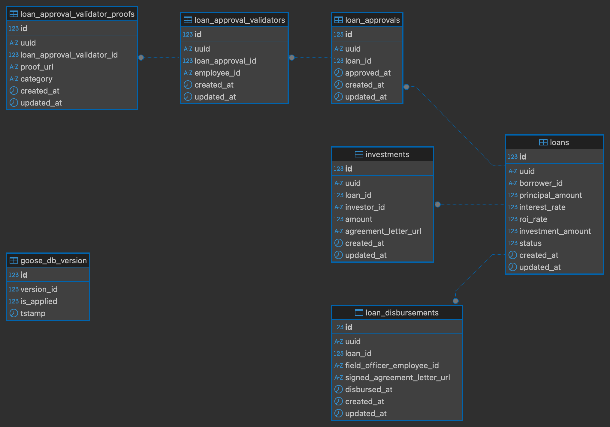

# Loan Service

A RESTful API service for managing loans built with Go, gorilla/mux, and MySQL.

## Features

- RESTful API endpoints for loan management
- MySQL database with GORM ORM
- Request validation and error handling
- Docker support for easy deployment
- Comprehensive logging

## Project Structure

```
loan-service/
├── main.go                 # Application entry point
├── go.mod                  # Go module file
├── go.sum                  # Go module checksums
├── Dockerfile             # Docker configuration
├── docker-compose.yml     # Docker Compose setup
├── Makefile              # Build and development commands
├── env.example           # Environment variables template
├── README.md             # Project documentation
├── migrations/            # Database migration files
├── mocks/                # Generated mock files for testing
└── internal/
    ├── config/           # Configuration management
    │   └── config.go     # Configuration structs and loading
    ├── server/           # HTTP server setup
    │   └── server.go     # Server configuration and routing
    ├── handlers/         # HTTP request handlers
    │   ├── interfaces.go # Handler interfaces
    │   ├── loan_handler.go # Loan domain handlers
    │   └── health_handler.go # Health check handler
    ├── middleware/       # HTTP middleware
    │   └── middleware.go # Logging and error handling middleware
    ├── models/           # Data models and structs
    │   ├── models.go     # Core data models
    │   └── enums.go      # Enum definitions
    ├── repository/       # Data access layer
    │   ├── interfaces.go # Repository interfaces
    │   ├── loan.go       # Loan repository implementation
    │   └── loan_test.go  # Repository unit tests
    ├── service/          # Business logic layer
    │   ├── interfaces.go # Service interfaces
    │   ├── loan.go       # Loan service implementation
    │   └── loan_test.go  # Service unit tests
    ├── dto/              # Data Transfer Objects
    │   ├── loan.go       # Loan request/response DTOs
    │   └── response.go   # Common API response structures
    └── client/           # External service clients
        ├── interfaces.go # Client interfaces
        └── notification_client.go # Notification service client
```

## Prerequisites

- Go 1.23 or higher
- MySQL 8.0 or higher
- Docker and Docker Compose (optional)

## Quick Start

### Using Docker (Recommended)

1. Clone the repository:
```bash
git clone <repository-url>
cd loan-service
```

2. Copy environment file:
```bash
cp env.example .env
```

3. Start the application with Docker Compose:
```bash
docker-compose up --build
```

The API will be available at `http://localhost:8080`

### Manual Setup

1. Install dependencies:
```bash
go mod tidy
```

2. Set up environment variables:
```bash
cp env.example .env
# Edit .env with your database credentials
```

3. Start MySQL database

4. Run the application:
```bash
go run main.go
```

## API Endpoints

### Health Check
- `GET /health` - Service health status

### Loans
- `GET /v1/loans` - Get all loans
- `POST /v1/loans` - Create new loan
- `GET /v1/loans/{uuid}` - Get loan by UUID
- `PUT /v1/loans/{uuid}` - Update loan
- `POST /v1/loans/{uuid}/approve` - Approve loan with validators
- `POST /v1/loans/{uuid}/invest` - Invest in loan
- `POST /v1/loans/{uuid}/disburse` - Create loan disbursement

## Development

### Available Make Commands

```bash
make build           # Build the application
make run             # Run the application
make test            # Run tests
make test-coverage   # Run tests with coverage
make clean           # Clean build artifacts
make deps            # Install dependencies
make lint            # Run linter
make dev             # Run in development mode
make migrate         # Run database migrations
make migrate-down    # Rollback last migration
make migrate-create  # Create new migration file
make generate-mocks  # Generate mock files for interfaces
```

### Running Tests

The project includes comprehensive unit tests for all layers:

```bash
# Run all tests
go test ./...

# Run tests with coverage
go test -coverprofile=coverage.out ./...
go tool cover -html=coverage.out

# Run specific test packages
go test ./internal/service -v
go test ./internal/repository -v
go test ./internal/handlers -v

# Generate mocks for interfaces
make generate-mocks
```

#### Test Coverage

- **Service Layer**: Business logic testing with mocked dependencies
- **Repository Layer**: Database operations testing with SQLite in-memory database
- **Handler Layer**: HTTP request/response testing
- **Mock Generation**: Automatic mock generation using `mockery` for interfaces

### Database Migrations

The application uses Goose for database migrations. Migrations are SQL files located in the `migrations/` directory.

#### ERD



#### Running Migrations

```bash
# Run all pending migrations
make migrate

# Or directly
go run main.go migrate

# Rollback last migration
make migrate-down

# Or directly
go run main.go migrate-down

# Create new migration
make migrate-create
```

#### Migration Files

Migration files follow the naming convention: `{timestamp}_{description}.sql`

Example: `20240101000000_create_loans_table.sql`

The timestamp format is `YYYYMMDDHHMMSS` which ensures proper ordering and avoids conflicts when multiple developers create migrations simultaneously.

## Configuration

The application uses environment variables for configuration. See `env.example` for available options:

### Server Configuration
- `SERVER_PORT` - HTTP server port (default: 8080)
- `SERVER_HOST` - HTTP server host (default: localhost)

### Database Configuration
- `DB_HOST` - Database host (default: localhost)
- `DB_PORT` - Database port (default: 3306)
- `DB_USER` - Database user (default: root)
- `DB_PASSWORD` - Database password (default: password)
- `DB_NAME` - Database name (default: loan_service)

### External Services
- `NOTIFICATION_SERVICE_BASE_URL` - Notification service base URL
- `NOTIFICATION_SERVICE_API_KEY` - Notification service API key
